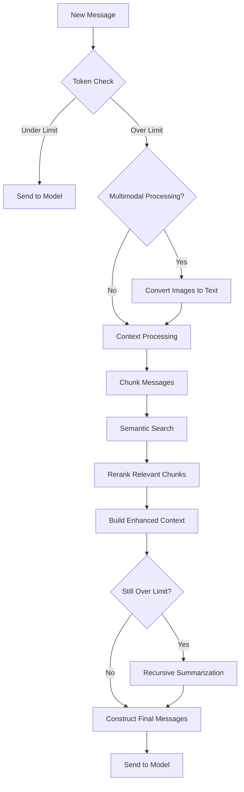

---

### 🚀 Advanced Multimodal Context Manager Plugin
**智能长上下文与多模态内容处理器**

---
#### 🌐 Overview | 概述
This plugin intelligently handles long-context conversations and multimodal content (text + images) in OpenWebUI. It automatically:
- Compresses long conversations using semantic retrieval and recursive summarization
- Adds image understanding capabilities to non-multimodal models
- Preserves critical context while staying within token limits
- Maintains conversation integrity with smart prioritization

本插件智能处理长上下文对话和多模态内容（文本+图片）。它能自动：
- 使用语义检索和递归摘要压缩长对话
- 为不支持多模态的模型添加图像理解能力
- 在Token限制内保留关键上下文
- 通过智能优先级保持对话完整性

---
#### 🔧 Installation | 安装
1. Place the plugin file in your OpenWebUI `plugins` directory
2. Install required dependencies:
```bash
pip install httpx tiktoken openai
```

---
#### ⚙️ Configuration | 配置
Set these environment variables or configure in the plugin UI:
```env
# Vectorization service
VECTOR_API_BASE=https://ark.cn-beijing.volces.com/api/v3
VECTOR_API_KEY=your_api_key_here

# Summarization service
SUMMARY_API_BASE=https://ark.cn-beijing.volces.com/api/v3
SUMMARY_API_KEY=your_api_key_here

# Reranking service
RERANK_API_BASE=https://api.bochaai.com
RERANK_API_KEY=your_api_key_here
```

---
#### 🔄 Workflow | 运行流程


Detailed Steps | 详细步骤:
1. **Token Check**  
   - Calculate total tokens in conversation  
   - Compare against model's token limit (with safety margin)  
   - 计算对话总Token数
   - 与模型Token限制比较（含安全边际）

2. **Multimodal Processing (if enabled)**  
   - For non-multimodal models: Convert images to text descriptions  
   - Uses vision models to describe image content  
   - 对于非多模态模型：将图片转换为文字描述
   - 使用视觉模型描述图片内容

3. **Context Processing**  
   - Split conversation into intelligent chunks  
   - Perform semantic search using vector embeddings  
   - Rerank chunks by relevance to current query  
   - 将对话拆分为智能分块
   - 使用向量嵌入进行语义搜索
   - 按与当前查询相关性重排分块

4. **Context Construction**  
   - Combine system messages + relevant context chunks + recent messages  
   - Preserve last 2 user-assistant exchanges intact  
   - 组合系统消息 + 相关上下文块 + 最新消息
   - 完整保留最后2组用户-助手对话

5. **Recursive Summarization (if needed)**  
   - Create hierarchical summaries when context still exceeds limits  
   - Preserves key information through multiple summarization passes  
   - 当上下文仍超限时创建分层摘要
   - 通过多轮摘要保留关键信息

6. **Final Delivery**  
   - Send optimized context to LLM  
   - Maintain conversation flow while reducing token usage by 30-70%  
   - 发送优化后的上下文给大模型
   - 保持对话流畅同时减少30-70%的Token使用

---
#### ⚙️ Configuration Options | 配置参数
| Parameter | Default | Description |
|-----------|---------|-------------|
| `enable_processing` | ✅ True | Enable/disable all processing |
| `enable_multimodal` | ✅ True | Add image understanding to non-vision models |
| `debug_level` | 1 | Debug verbosity (0-3) |
| `token_safety_ratio` | 0.85 | Safety buffer below model limit |
| `preserve_last_messages` | 2 | User+assistant pairs to keep intact |
| `vector_similarity_threshold` | 0.5 | Minimum relevance score for context chunks |
| `max_recursion_depth` | 3 | Max summary levels for long contexts |

| 参数 | 默认值 | 说明 |
|-----------|---------|-------------|
| `enable_processing` | ✅ 开启 | 启用/禁用所有处理功能 |
| `enable_multimodal` | ✅ 开启 | 为非视觉模型添加图像理解能力 |
| `debug_level` | 1 | 调试详细程度 (0-3) |
| `token_safety_ratio` | 0.85 | 低于模型限制的安全缓冲 |
| `preserve_last_messages` | 2 | 保留完整的用户+助手对话对数 |
| `vector_similarity_threshold` | 0.5 | 上下文块的最低相关性分数 |
| `max_recursion_depth` | 3 | 长上下文的最大摘要层级 |

---
#### 🌟 Features | 功能亮点
- **Context-Aware Compression**  
  Preserves relevant historical context using semantic similarity
- **Multimodal Bridge**  
  Enables image understanding for text-only models
- **Intelligent Chunking**  
  Splits content at natural language boundaries
- **Progressive Summarization**  
  Maintains information integrity through recursive abstraction
- **Visual Feedback**  
  Shows real-time processing status in OpenWebUI interface

- **上下文感知压缩**  
  使用语义相似度保留相关历史上下文
- **多模态桥接**  
  为纯文本模型添加图像理解能力
- **智能分块**  
  在自然语言边界拆分内容
- **渐进式摘要**  
  通过递归抽象保持信息完整性
- **可视化反馈**  
  在OpenWebUI界面显示实时处理状态

---
#### ⚠️ Requirements | 要求
- OpenWebUI v0.5.17+
- Python dependencies: `httpx`, `tiktoken`, `openai`
- API keys for:
  - Vectorization service
  - Summarization service
  - Reranking service (optional)

---
#### 🐛 Debugging | 调试
Set debug level in plugin configuration:
- `0`: No debugging
- `1`: Basic processing info
- `2`: Detailed chunk-level info
- `3`: Full API request/response logging

在插件配置中设置调试级别：
- `0`: 无调试
- `1`: 基本处理信息
- `2`: 详细分块信息
- `3`: 完整API请求/响应日志

---
#### 📜 License | 许可证
MIT License - Free for personal and commercial use

---

This README provides comprehensive documentation in both English and Chinese, covering installation, configuration, workflow, features, and usage details for the Advanced Multimodal Context Manager plugin. The workflow diagram visually explains the processing pipeline, while the bilingual format makes it accessible to international users.
